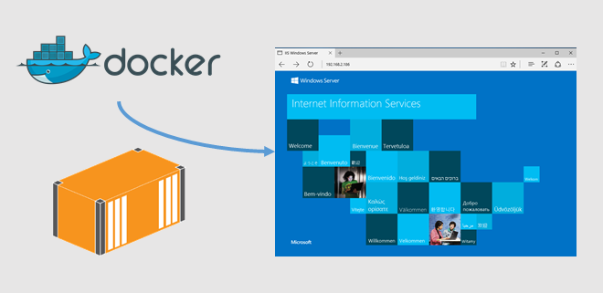

Ако използвате Windows 10 Pro или Windows 10 Enterprise, 
тогава без проблем можем да използваме Windows Nano Server и Windows Server Core, 
без да създаваме виртуална машина с Windows Server 2016,
ние ще използваме IIS върху Windows Server Core 
използвайки новата технология на Microsoft - Windows Containers и Docker. 

Най напред трябва да имаме инсталиран Docker на нашата Windows 10 машина. 
В този [материал](https://docs.microsoft.com/en-us/virtualization/windowscontainers/quick-start/quick-start-windows-10)
от MSDN е доста добре описан процеса на инсталиране и конфигуриране на Docker върху Windows 10.

Microsoft ни дава две нови версии на Windows Server: Server Core и Nano Server. 
Nano Server е минимална ос която има единственo <em>PowerShell</em> и ние върху нея не можем да инсталираме никакви msi или exe програми.

## docker run
Нека да започнем, трябва да си отворим един PowerShell и да си стартираме Docker, 
след което да изпълним следното:

```powershell
PS C:\Users\csyntax\Documents\SampleProject> docker run -ti microsoft/windowsservercore cmd
```

Ако това е първо стартиране на Windows Server Core, ще трябва да се изтеглят около 4GB пакети. 
След като всичко се е изпълнило и нямаме никакви грешки, вече имаме напълно функционален Windows Server Core, работещ върху нашият Windows 10 и използвайки Hyper-V за нашият контейнер.

## Dockerfile за .NET
Да речем, че имаме съществуващ ASP.NET проект и искаме да го пуснем на Docker под нашият Windows контейнер. За това нека си създадем Dockerfile за нашият проект и да го пуснем върху IIS.

За да сме сигурни, че получаваме само един слой за .NET и ASP.NET, 
които ще използваме <strong><em>;</em></strong> за да ги разделим. 

```dockerfile
FROM microsoft/iis:10.0.14393.206
SHELL ["powershell"]
RUN Install-WindowsFeature NET-Framework-45-ASPNET ; Install-WindowsFeature Web-Asp-Net45
EXPOSE 80
```

След като сме си създали нашият <em>Dockefile</em>, спокойно вече можем да го изпълним в <em>PowerShell</em>:

```powershell
PS C:\Users\csyntax\Documents\SampleProject> docker build -t iis .
```

Ако нямаме никакви проблеми ще получим следното или подобен резултат:

```powershell
Sending build context to Docker daemon 2.048 kB 
Step 1/5 : FROM microsoft/iis:10.0.14393.206 
 ---> e4525dda8206
Step 2/5 : SHELL powershell 
 ---> Running in 367d5890f81e
 ---> a30ac5167e6c
Removing intermediate container 367d5890f81e 
Step 3/5 : RUN Install-WindowsFeature NET-Framework-45-ASPNET ;     Install-WindowsFeature Web-Asp-Net45 
 ---> Running in e87db5ce5678
Success Restart Needed Exit Code      Feature Result 
------- -------------- ---------      --------------
True    No             Success        {ASP.NET 4.6}
True    No             Success        {Application Development, ASP.NET 4.6,... 
```

## Малко редакции по Dockerfile
След като сме си създали нашият Dockerfile и всичко е наред, трябва да направим малко редакции относно стартирането и изпълнението на нашият проект. Стандартно като сме си инсталирали IIS, с него идва и&nbsp;application pool както и "Default Web Site" който ще премахнем и ще качим нашият ASP.NET сайт. 

```dockerfile
FROM microsoft/iis:10.0.14393.206
SHELL ["powershell"]
RUN Install-WindowsFeature NET-Framework-45-ASPNET ; \ Install-WindowsFeature Web-Asp-Net45
COPY SampleProject SampleProject 
RUN Remove-WebSite -Name 'Default Web Site'
RUN New-Website -Name 'SampleProject' -Port 80 -PhysicalPath 'C:\csyntax\Documents\SampleProject' -ApplicationPool '.NET v4.5'
EXPOSE 80
CMD ["ping", "-t", "localhost"]
```

И накрая за да логваме всичко ще добавим и тези редове към Dockerfile:

```dockerfile
CMD Write-Host IIS Started... ; \ 
    while ($true) { Start-Sleep -Seconds 3600 }
```

## Docker изображение
Вече можем да си направим и изпълнимо изображение за Docker.

```powershell
PS C:\Users\csyntax\Documents\SampleProject> docker build -t sampleproject .
```

Използваме -p 80:80 за да пуснем IIS на порт 80.

```powershell
PS C:\Users\csyntax\Documents\SampleProject> docker run --name sample -d -p 80:80 sampleproject
```

Веднъж пуснат нашият контейнер, ни е нужен ни е само IP адресът му за да го отворим в браузъра.

```powershell
PS C:\Users\csyntax\Documents\SampleProject> docker inspect --format="{{.NetworkSettings.Networks.nat.IPAddress}}" sample
```

## Какво направихме?
* Стартирахме **Windows Server Core** на **Windows 10**
* Използваме **Hyper-V** за виртуализация на процеса
* Стартирахме **ASP.NET** приложение върху **IIS** използвайки **Docker**