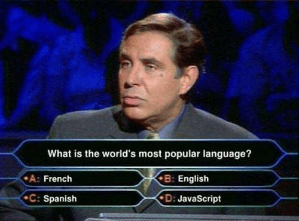

JavaScript, понякога е доста отзивчив, а понякога доста нетърпим.
В тази статия ще ви покажа доста, на кратко някой от най-извесните странни поведения на JavaScript.

## Всичко е обект
Като изключим примитивните типове в JavaScript,
които се явяват като наследници  на  Object и от там идва леко объркване.
И от тук разбира се веднага бихте си помислили,
че всичко е обект с изключение на типът null, да, ама грешите, дори типът null e обект.
	
```javascript
typeof null; // return Оbject
```

Но въпреки това за типът null, тази дефиниция има тотална липса на логика.

```javascript
null instaceof Object; // return false
``` 

Така, че null е обект, но също и не е обект.

## Undefined е defined

Колкото и да е странно за undefined, макар и да е ключова дума в JavaScript, 
може да бъде напълно дефинирана.

```javascript
var hello;
hello == undefined; // return true
```

Всичко до тук е добре, но има и един момент в който не решаваме да присвойм стойност undefined.

```javascript
undefined = "Hello";
var hello;
hello == undefined; // return false 
```

Въпреки, че сме присвоили стойност на нашата променлива след сравнение с undefined
и получаваме резултат falsе.
За това нещо обяснението е, че преди това сме присвоили стойност на undefined.

## NaN e число
Предполагам помните абсурдният случай със типът null.
Нещо още по-странно е, че NaN, което означава "Not a Number" в JavaScript е число.

```javascript
typeof NaN; // return Number
NaN === NaN; // return false
"Hello Word!" === NaN; // return false
isNaN("Hello Word!"); // return true
```

## Math.min() > Math.max()
Tова е също доста абсурдно. Най-простото обяснение на този доста абсурден случай е,
че Math.min() връща "+ безкрайност", а Маth.max() връща "– безкрайност".

```javascript
Math.max() > Math.min(); // return false
```

## Заместване в низовете
Ако си мислите, че методът replace, адекватно замества всички търсени символи,
жестоко се лъжете. Методът replace замества във даденият низ само първият намерен символ,
а не всички.

```javascript
"Gosho".replace("o", "e"); // return "Gesho" 
```

За щастие ако използваме добрите стари регулярни изрази, нямаме този проблем.

```javascript
"Gosho".replace(/[o]/g, "e"); // return "Geshe" 
```

## Методът Length
Някои стойности по подразбиране също могат да бъдат малко подвеждащи.
Да кажем, че дължината на Function по подразбиране е 1,
докато дължината на Function прототипа е 0.

```javascript
var a = Function.length; // return 1
var b = new Funtion().length; // return 0 
```

## Математически операции
JavaScript не е език на който можете да разчитате за точни сметки.

```javascript
var a = 111111111111111110000 + 1111; // return 111111111111111110000
var b = 0.8 - 0.6; // return 0.20000000000000007
```

## Заключение
За мое съжаление в тази статия ви показах само част от лошите страни на JavaScript,
но макар и JavaScript да има и лоши страни това не означава, че не трябва да го използвате.
Надявам се някой път да разгледаме добрите и интересните страни на JavaScript.