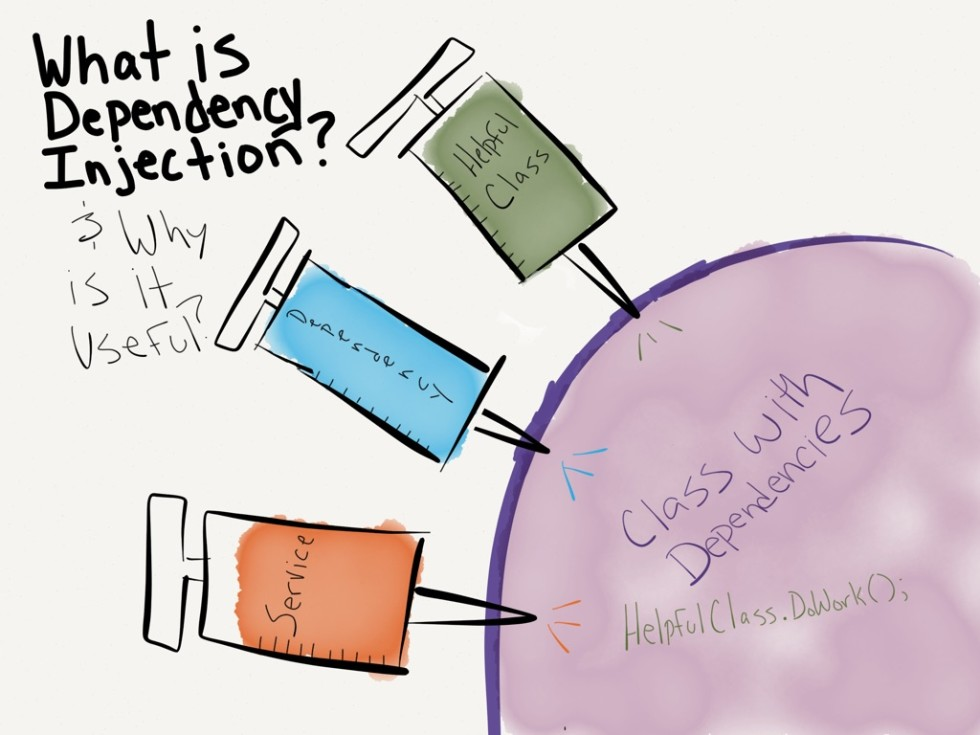

Луд умора няма. Онзи ден нямане какво да правя реших – абе дай да си направя един простичък Dependency Injector. И преди да опиша какво е това, мисля, че е по-добре да разясня какво е *"обръщане на контрола" (Inversion of Control)* и *"инжектиране на зависимости" (dependency injection)*.

## Inversion of Control
Когато пишем проектите си, използвайки някой обектно-ориентиран език много често обичаме да пишем “конкретно”,а не “абстрактно”. Тоест обичаме да зависим на конкретни имплементации, а не на абстракции. Пример за това е, ако да речем имаме един клас *Lamp* и един бутон за нейното включване – клас *Button*.

По-неопитните с OOP биха предложили да направим директна връзка между между лампата и бутона, като по този веднага бихме създали една зависимост. За да оперира коректно нашата лампа тя зависи от един бутон, чиято единствена цел би била да я включи. И това определено не е добра идея.

Вместо можем да си изнесем един интерфейс (например да го кръстим *ILightSwitcher*), чиято единствена цел би била да се разпорежда с включването на лампата. По този начин разкачваме двата класа и премахваме зависимостта между двата класа – и двата ще зависят от абстракция, а не от конкретни имплементация. Това е което наричаме обръщане на контрола – когато нашите модули от високо ниво (каквато е лампата ни), не зависят от модули от по-ниско ниво (какъвто е нашият бутон). И двете зависят от абстракции.

## Dependency Injection
Какво представлява “инжектирането на зависимости” – това представлява шаблон за дизайн, който ни позволява да остраним здравите връзки между класовете и да ги подменяме по време на компилация или по дори и по време на изпълнението на нашата програма. 
При инжектирането на зависимости се открояват три елемента:

* Зависим елемент
* Декларация на зависимости – различни типове договори (интерфейси, абстрактни класове)
* Контейнер(container/resolver) на зависимостите

### Какво ще рече това?
Главната мотивация за създаването на този шаблон е да могат да се променят конкретните имплементации, които се използват по време на изпълнение на програмата, а не при компилиране. Това позволява кодът, който пишем да е много по модуларен и разкачен, което го прави в същото време и много по-тестваем.

## Примерна имплементация на Inversion of Control Container
Има много различни IoC контейнери (например *Ninject*, *Autofac*, *StructureMap*).
И всъщност основната им имплементация не е много сложна – имаме един речник, в който ключа е типът на зависимостта, а стойността е конкретният тип на разрешението й.
Нека започнем така:

```csharp
public class Container
{
    private readonly IDictionary<Type, Type> dependencies;
    private readonly ContainerOptions options;

    public Container(ContainerOptions options = ContainerOptions.None)
    {
        this.options = options;
        this.dependencies = new Dictionary<Type, Type>();
    }
}
```

**ContainerOptions** е просто енумерация, която, въпреки че не използва много в текущия проект, бихме могли да я използваме за да конфигурираме допълнитено начина, по който разрешаваме зависимостите.

След като сме дефинирали основните ни променливи и конструктори, които ще използваме, ни трябва начин да регистрираме зависимости и как да те да бъдат разрешавани. 
Тоест, двойка типове, които ни показват кой клас да се инстанцира, когато ни е необходим конкретна имплементация на даден интерфейс.

```csharp
public void RegisterType<TDependency, TResolve>()
    where TDependency : class
    where TResolve : class
{
    this.dependencies.Add(typeof(TDependency), typeof(TResolve));
}
```

Единственото, което ни остава е все пак да разрешим зависимостта. 
Ще го направим рекурсивно, използвайки алгоритъма за обхождане в дълбочина. 
По този начин ще си гарантираме, че ако някое от нашите разрешения има свои зависимости, бихме могли да ги разрешим и тях.

```csharp
public T Resolve<T>() where T : class
{
    var constructors = typeof(T).GetConstructors().OrderByDescending(p => p.GetParameters().Count());

    if (!constructors.Any())
    {
        throw new ArgumentException("The class to be resolved does not have any public constructors!");
    }

    foreach (var constructor in constructors)
    {
        var parameters = constructor.GetParameters();

        if (parameters.Length == 0)
        {
            return Activator.CreateInstance<T>();
        }
        else
        {
            var parameterObjects = new List<object>();

            foreach (var parameter in parameters)
            {
                var parameterType = parameter.ParameterType;
                var parameterTypeObjects = parameterType.GetConstructors().Any(p => !p.GetParameters().Any());

                if (this.options.HasFlag(ContainerOptions.UseDefaultValue))
                {
                    if (parameter.HasDefaultValue)
                    {
                        var res = Convert.ChangeType(parameter.DefaultValue, parameterType);

                        parameterObjects.Add(res);

                        continue;
                    }
                }

                if (parameterType.IsAbstract || parameterType.IsInterface)
                {
                    var concreteObjectType = this.dependencies[parameterType];
                    var method = typeof(Container).GetMethod("Resolve").MakeGenericMethod(concreteObjectType);
                    var obj = method.Invoke(this, null);

                    parameterObjects.Add(obj);
                }
                else if (parameterType.IsPrimitive || parameterTypeObjects)
                {
                    var obj = Activator.CreateInstance(parameterType);

                    parameterObjects.Add(obj);
                }
            }

            if (parameterObjects.Count != constructor.GetParameters().Length)
            {
                continue;
            }

            return (T) Activator.CreateInstance(typeof(T), parameterObjects.ToArray());
        }
    }

    throw new Exception("Could not resolve the dependency");
}
```

Трябва, обаче да се има предвид, че това е непълна имплементация, която може да се разглежда като интересно упражнение и да изясни някои неясноти относно *Inversion of Control контейнерите*, по какъв начин действат и какво представлява dependency injection.
Пълният код може да бъде намерен [тук](https://github.com/csyntax/IoC-Container).