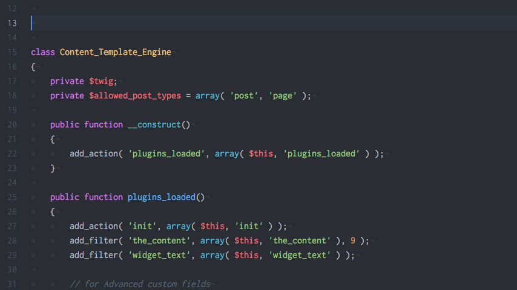
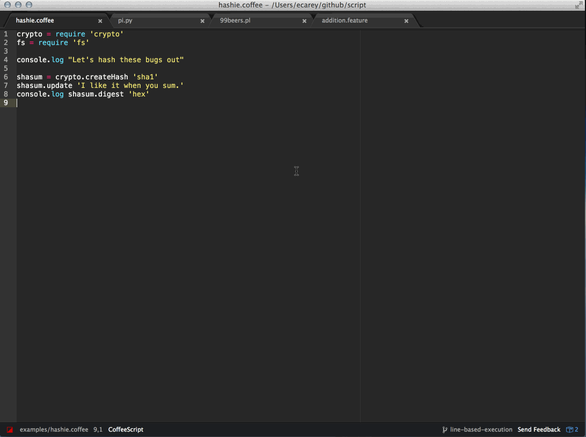

Доста хора ме питат за добри плъгини за Atom, които да улесняват писането на код и въобще употребата на Atom. 
Тук бих искал да споделя  някои от плъгините, които изполавам и ми помагат значително. 
Смятам, че изброените по-долу пакети превръщат *Atom* в прекрасно *IDE*.

## Linter


## linter-eslint
Linter за JavaScript синтаксис. Ако искате да използвате специфична конфигурация за вашия Linter,
просто си създайте `.eslintrc.json` в главната директория на вашия проект и след това направете вашите настройки там.

```javascript
{
    "env": {
        "es6": true,
        "node": true
    },
    "extends": "eslint:recommended",
    "rules": {
        "indent": [
            "error",
            4
        ],
        "no-console":"off",
        "linebreak-style": [
            "error",
            "windows"
        ],
        "quotes": [
            "error",
            "single"
        ],
        "semi": [
            "error",
            "always"
        ]
    }
}
```

## autocomplete-project-paths
Аutocomplete е подходящ плъгин за подръжка на пътищата във вашия проект.
Само започнете с `./` и продължете да навигирате.



## Script
Изпълнение на скриптови файлове директно в *Atom* (подобно на *Sublime*).
Перфектен за работа с _JavaScript_ и _Python_.

