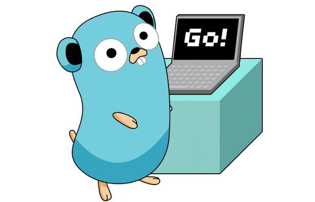

През последните няколко години, езикът Go доста нашумя в света на
програмирането. Нищо не прави един програмист луд, отколкото ученето
на нов език за програмиране, нали така?

Така че аз от последните месеци на миналата година аз прекарвам
мойто свободно време в изучаване на Go!

Не мисля да ви уча тук как се пише **"Hello, Word!"** на Go, има
доста документации и уроци от Google който ще свършат тази работа.
Аз по скоро искам да изясним защо се нуждаем от език като Go и защо
трябва да се интересуваме от връзката софтуер-хардуер?

## Хардуерни ограничения
В днешно време имаме много видове процесори с различни архитектури, честоти, мощности и т.н и
също така в същото време почти всяко модерно приложение изполва различни връзки към БД, кешове и други
услуги най-често външни който имат изисквания към хардуерни ресурси и изисквания към него и точно за
това софтуерът който правим трябва да бъде съвместим с тях.

Но голяма част от езици като C#, Java, Python са single threaded но подържат и multi-threading.
Ето тук идва проблема със синхронизацията на тези нишки да работоят съвместно.

Например създраване на една нишка в C# не винаги е ефективен процес защото отнема около 1МB head
памет и ако започем да извикваме хиляди нишки става проблем и ще бъде прекъснато изпълнението
защото ще ни свърши паметта. Също така ако искаме да общуваме между две или по-вече нишки
става доста трудна задача.

Google през 2009г. пусна Go, на бял свят и идеята на езика беше да държи perfomance и да имаме
малка консумация на памет. Така че да можем да въртим хиляди итерации без проблеми.

**Други ползи от езика:**
* имаме по-голямо бързодействие от страна на езика което е голямо предимство
пред нишките и тяхната синхронизация;
* езика е базиран на примитивни типове от данни, а не от обекти както C#, Java което
също е голяма предимство за неговото бързодействие;
* Съшо така езикът директно комуникира с операционната система и хардура, а не изполва
трети източници;

Всички горе споменати точки правят Go наистина мощен език за програмиране който съвсем
спокойно се нарежа до C/C++ като във същото време ни предлага подреденост на нишките
и конкурентност между тях като при Erlang. Go ни дава доста добра възможност и ефикастни
методи за управление на нишки.

## Go работи директо върху хардуера
Както може би подчертах вече най-голямото предимство на Go е точно това че той разботи
директно с хардуера и имаме пълен контрол върху него точно както при C/C++, също така
Go има доста по-добър perfomace дори от Python поради причината че езика се компилира и
не е скриптов, но и важна роля играе въпроса за работа с хардуера.

Процесора разбира двойчни файлове, обикновено езици като C# и Java те се изпълнват от виртуални
машини и нямат достъп до хардуера и негови ресурси, докато езици като C/C++ няма проблеми.

При C/C++ нямаме такава виртуална машини, а работим директно с ресурси на самият компютър
и операционна система. И нашият код директно се компилира до двуичен код, като имаме
изкюлчително бързодействие и гъвкавост.

При Go се наблюдава същият начин на работа но сме доста по облекчени при работа и управление с
памет, функции като *malloc()*, *calloc()*, *free()* който се полват доста активно при C/C++, в
Go се представят до доста различен начин който е доста удобен и лесен спрямо познатият начив чрез
по горните три функции в C/C++.

## Писането на код със Go е лесно
Go не е от онези езици със странен и луд синтаксви тук не говоря за Python, а за други
езици като Haskell, Ruby и други, който имам странен синтаксис. Създателите на езика
са имамали за идея на направят красив, удобен и във всъщото време модерен сънтаксис на
езика така че да бъде лесен за четене и учене. Google и хилди други програмисти и общности
работят по развитието на езика и неговото бъдеще като идеята е с малко работа да правим
големи неща като имаме качество и бързодействие.

Go не OOP език и не се придържа към този начин на писане на код.
* *Нямаме класове*, единствено имаме пакети който се грижата за подредбата на файловете
и структури който са подобни на класовте на работят по сравнително различен начин от тях;
* *Нямаме наследяване*, функциите могат лесно да се преработват, но ние не можем да правим
наследявания като при C#, Java, Python.
* Няме конструктори
* Няме генерици
* Няма изключение

Както виждаме Go e доста различен език от **C#** например,
но в някой аспекти е по-близък до **C**
като напълно се придържаме към употребата на структори и функции едиствено при писане на
код.

***Aз не харесвам идеята на Swift, Go е доста по-стабилен и съвместим от него.***

## Go e дело на Google!
Предполагам вече разбрахте, че езикът е създаден и се разбработва от **Google** също така по него
работи и съавтора на **C**. **Go** e доста ефективен и качествен език върху който са се концентрирали още
доста компании като **IBM**, **Microsoft**, **Intel**.
